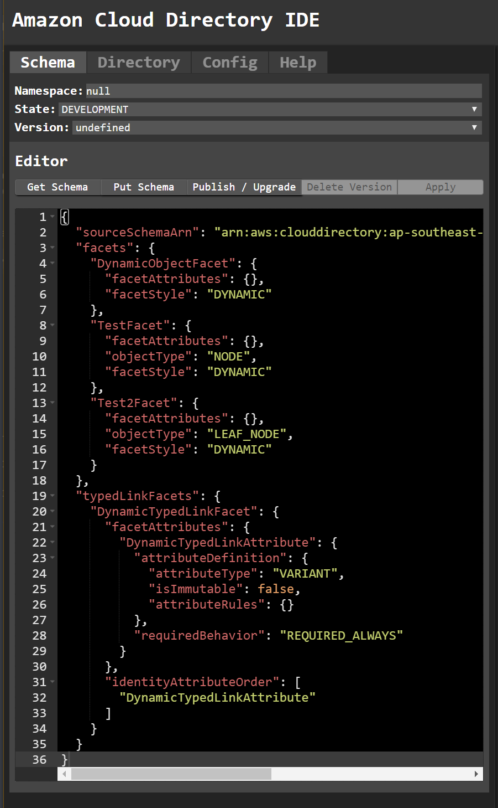

# Cloud Directory IDE
## ⚠📈 [WIP on Github Pages](https://rupertbg.github.io/aws-cloud-directory-ui/) 📊⚠

## Overview
A __client-side__ IDE for working with AWS Cloud Directory in your browser. There is no backend other than your own [AWS Cloud Directory](https://docs.aws.amazon.com/clouddirectory/latest/developerguide/what_is_cloud_directory.html) and [Google Sign In](https://developers.google.com/identity/sign-in/web/sign-in#before_you_begin).

## Setup
To get the UI working with your AWS Account deploy `role.yml` via CloudFormation. Using [AssumeRoleWithWebIdentity](https://docs.aws.amazon.com/STS/latest/APIReference/API_AssumeRoleWithWebIdentity.html), the app uses a Google Account of your choosing to assume the Role you create in your account.

1. Decide whether to run locally or use the [Github Pages version](https://rupertbg.github.io/aws-cloud-directory-ui/).
2. If running locally set up Google Sign In [here](https://developers.google.com/identity/sign-in/web/sign-in#before_you_begin). Skip this step if you're using the Github Pages Version.
3. Deploy `role.yml` in your AWS account.
4. Enter the AWS IAM Role ARN and Region when requested. If running locally you will first need to enter the Google Client ID you created above.

You can make your own Google Sign In and use the app locally, or run it directly using mine from [Github Pages](https://rupertbg.github.io/aws-cloud-directory-ui/)

## User Interface
There are two main editors, one for Schemas and another for the Directory. At the top of the editor you can see:
- `Namespace`: This is your Google User ID. It is used to name Directories and Schemas in your AWS Account.
- `State`: This is either DEVELOPMENT, PUBLISHED, or APPLIED
- `Version`: This is the current version of the Schema. Only applies to Published or Applied Schemas.

## TODO / Wishlist
- Get typed link facets working
- Traverse tree to populate graph
- Collapse large directories in graph? Click to expand node?
